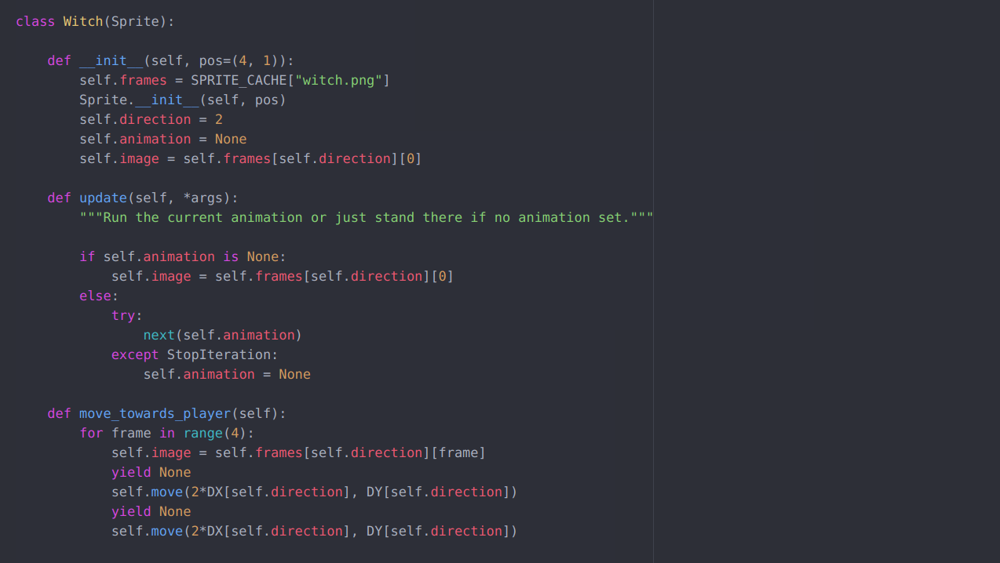
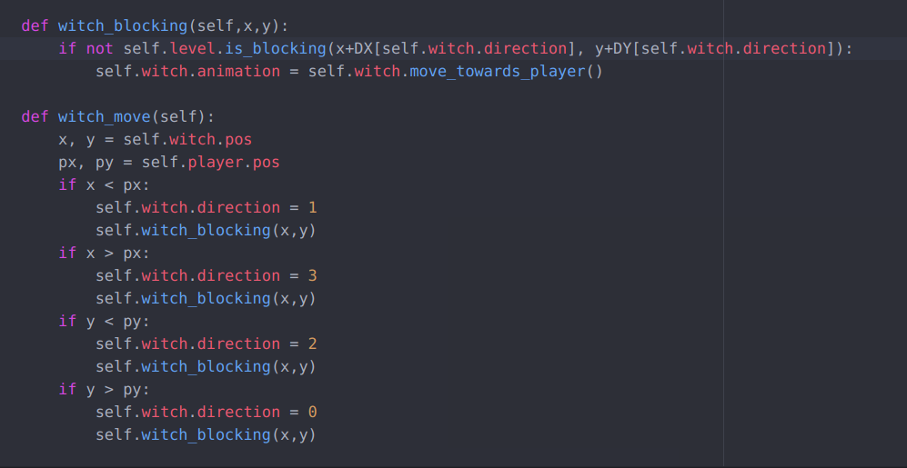

| [Home](index.md) 	| [Project Evolution](ProjectEvolution.md)  | [Game Architecture](GameArchitecture.md) 	| [About Us!](AboutUs.md)

## Game Architecture 

  UML diagram of the main classes involved in the game

### Controls
The controls are located in the main script - "Ovenhouse.py" - which allows the player to move using the arrow keys and interact with enemies and items. If the player runs into an enemy or the witch, the game ends, and it's Game Over. 

The Game class represents what the player sees and interacts with. The Levels class sets up the levels and each “item” in the levels for the player to see. The Sprite class is connected to all of the interactive sprites (Player, Minions, Witch, Key, and Exit) to establish the animations and updates for the sprites. The Minions class updates the minion's movements and collisions. The Witch class will include the code for the witch movement. The Player class is the sprite the player controls. The Witch classes displays the witch and has it move towards the player. The Key class initializes which key is displayed where. The Exit class initializes the exit door so it can be accessible by the player. The TileCache class takes the images and divides them into “tiles” to be put into the levels. The The SortedUpdates class sorts the sprites by depth.

### Integrating Art
Integrating art took the collaboration between programming and graphics. Due to the structure of the game mechanics, the art had to be redesigned multiple times. This involved a redesign of the art of the levels, the character designs, 

### Chasing Witch
The algorithm that makes the witch chase the user uses the comparison between the player's position and the witch's position to make the witch chase the player as they are playing the game. 

The method *move_towards_player* within the Witch class simply advances the witch a certain distance (DX, DY) corresponding to the selected direction of the witch. Later on, the method *witch_blocking* in the Game class is used to check whether the witch collides into the wall. If the witch collides into a wall, then the witch stops moving; if the witch doesn't, the witch moves depending on the specified direction. Right below this method, the method *witch_move* is what actually moves the witch, by calling on *witch_blocking* that calls on *move_towards_player*. *witch_move* checks whether the player is located above, below, right, or left of the witch's position, then sets the direction of the witch.  

