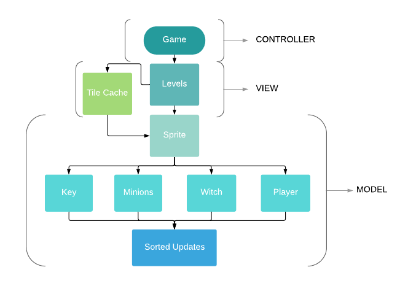
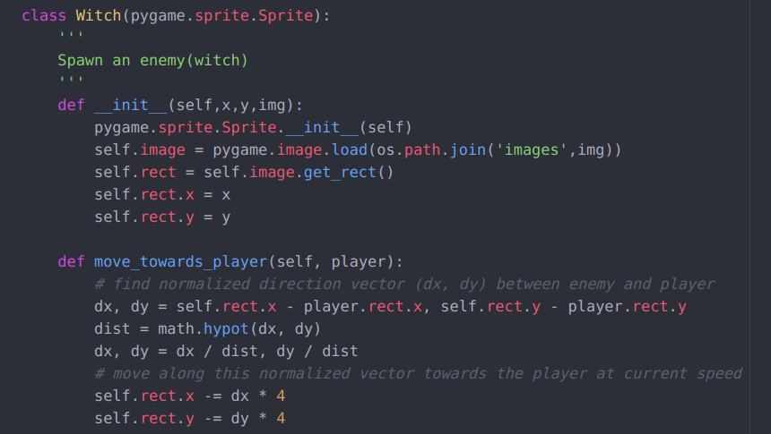

| [Home](index.md) 	| [Project Evolution](ProjectEvolution.md)  | [Game Architecture](GameArchitecture.md) 	| [Results](Results.md)  | [About Us!](AboutUs.md)

## Game Architecture 

  UML diagram of the main classes involved in the game

### Controls
The controls are located in the main script which allows the player to move using the arrow keys and interact with enemies and items. If the player runs into an enemy, the game ends, and it's Game Over.

### Integrating Art

### Chasing Witch
The Witch class has a method that calculates the vectorizes the distance between the witch and the player, and then makes the witch follow the player depending on the set speed. Due to this method, the witch's speed is the only factor that can be modified and will be restricted; on the contrary, the witch's direction of movement will be free-form/unrestricted. 

