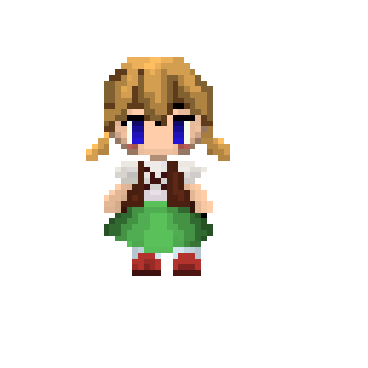
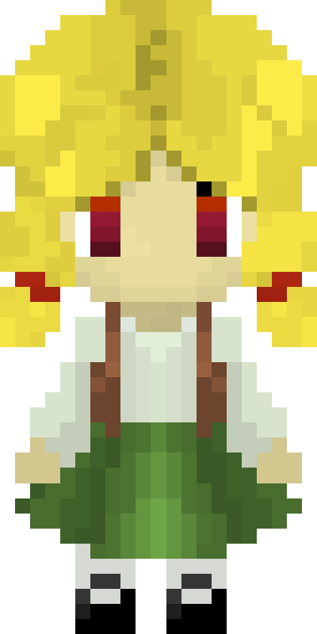
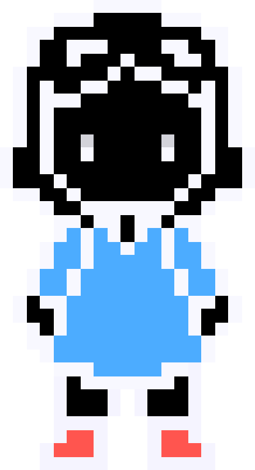
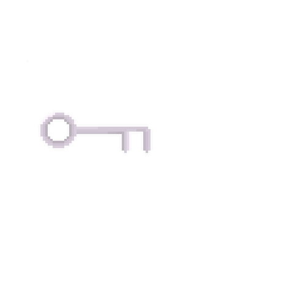
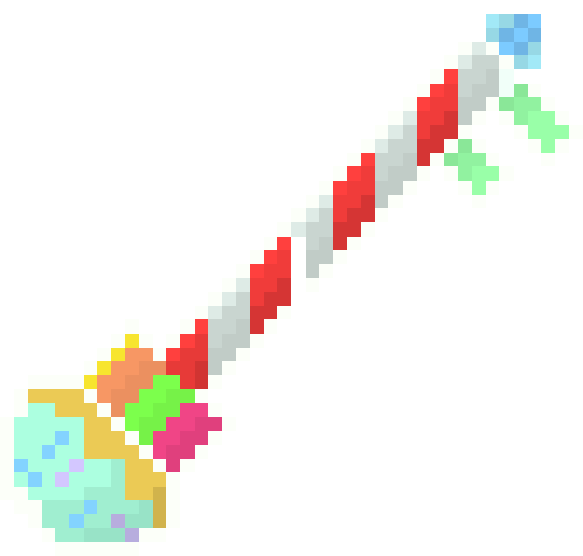
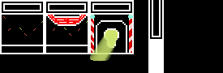
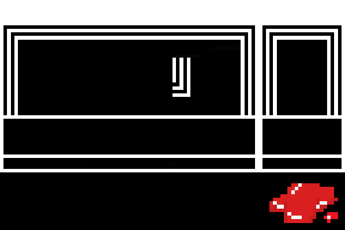
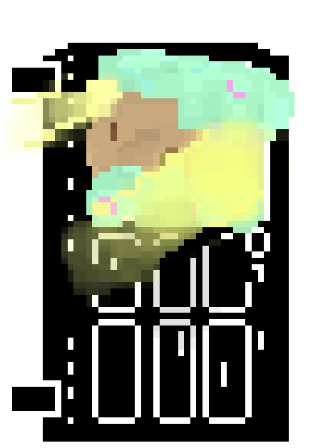
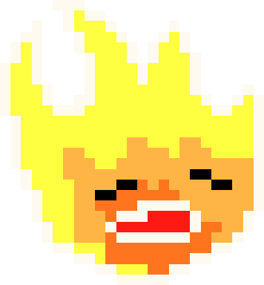
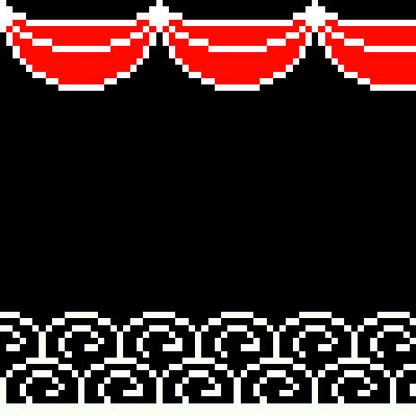

| [Home](index.md) 	| [Project Evolution](ProjectEvolution.md)  | [Game Architecture](GameArchitecture.md) 	| [Results](Results.md)  | [About Us!](AboutUs.md)

## Artwork Evolution
Our project went through a few design iterations that varied due to the program, and also due to peer review.

Initially, the game was going to be in full color, with shading. The initial character was more bubbly, with round hands and a more oval face. We wanted her to have a sweeter look that shows innocence yet maturity so we redesigned her to look more proportional and with less vibrant colors.

We got mixed reviews for the character design, some liking and one deeply disliking. As a result the whole art style was redesigned in order to avoid further conflict. The current style is black and white, with some color standing out in order to represent significance in the story. 
Gretel for example now has no defined hair color or skin color in order to allow the player to become them. The main feature that stands out is her blue dress. The witch was also redesigned to seem more powerful, with an upper hand over the player. She is now floating on a cloud, which also ties into her ability to go over structures and through walls in her house. Her bright colors also present the power that she holds within herself. 
The rooms themselves also had a major redesign in order to fit with the room-making algorithm. Rather than being individual pngs, they features are all on bitmaps and have been redesigned and resized. 

### Gretel

Gretel 1

Gretel 2

Gretel 3

### Key

Key 1

Key 2

### Layout

Layout 1

Layout 2

### Others after redesign

Witch

Door

Fire

Wall

