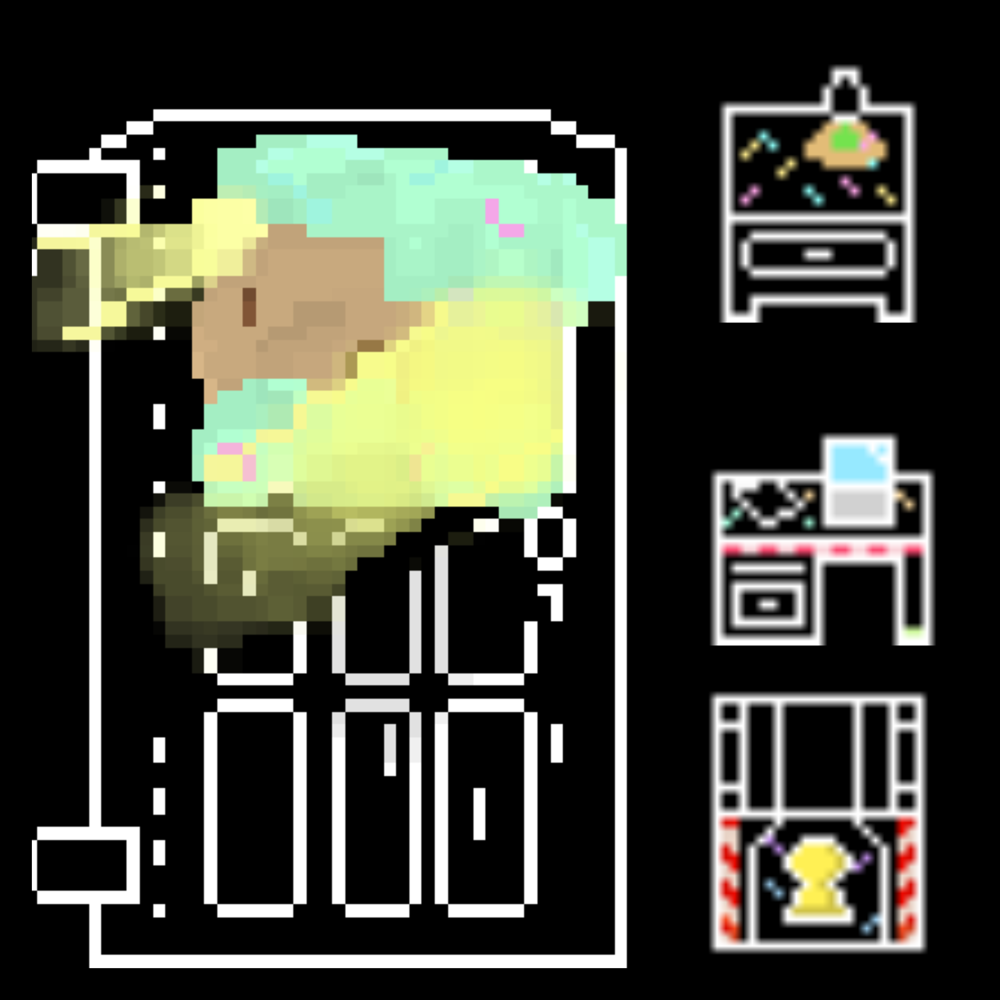

| [Home](index.md) 	| [Project Evolution](ProjectEvolution.md)  | [Game Architecture](GameArchitecture.md) 	| [About Us!](AboutUs.md)

## Idea Evolution
OvenHouse had humble beginnings, we had no idea which direction we wanted to go with our final project. After our first conversation, we knew we wanted to build some an enjoyable game. Over the next two meetings, we decided to move forward with a classic fable, and specifically, Hansel & Gretel. 

# Other Leading Ideas
The Boy Who Cried Wolf: You are the boy going around a dark village looking for villagers while avoiding the wolf
Save the Titanic: You are trying to get to the captain's control room
Pandoras Box: You decide not to open box, you win, if you open the box you need to solve puzzles

At this point, week three, we split up tasks and stuck with them for the duration of the project. Caleb on the timer + project organization + video, Audrey on the controls + backend + movement + collision, HK on the witch + text generation + key generation, and Kristtiya on custom artwork. The only non-artwork, and non-code pivot was with the video. The video began as a segmented short with each team member walking users through their contribution. It ended up being a fluid full gameplay with each player pointing out what they worked on and talking listeners through their process.

## Artwork Evolution
Our project went through a few design iterations that varied due to the program, and also due to peer review.

Initially, the game was going to be in full color, with shading. The initial character was more bubbly, with round hands and a more oval face. We wanted her to have a sweeter look that shows innocence yet maturity so we redesigned her to look more proportional and with less vibrant colors.

We got mixed reviews for the character design, some liking and one deeply disliking. As a result the whole art style was redesigned in order to avoid further conflict. The current style is black and white, with some color standing out in order to represent significance in the story. 
Gretel for example now has no defined hair color or skin color in order to allow the player to become them. The main feature that stands out is her blue dress. The witch was also redesigned to seem more powerful, with an upper hand over the player. She is now floating on a cloud, which also ties into her ability to go over structures and through walls in her house. Her bright colors also present the power that she holds within herself. 
The rooms themselves also had a major redesign in order to fit with the room-making algorithm. Rather than being individual pngs, they features are all on bitmaps and have been redesigned and resized. 

### Gretel

Gretel Development

### Hansel

### Witch

Witch Development

### Sprites

Sprite Movements

### Key

Key Development

### Layout

Layout 1

Layout 2

### Others after redesign

Sample Furnitures

